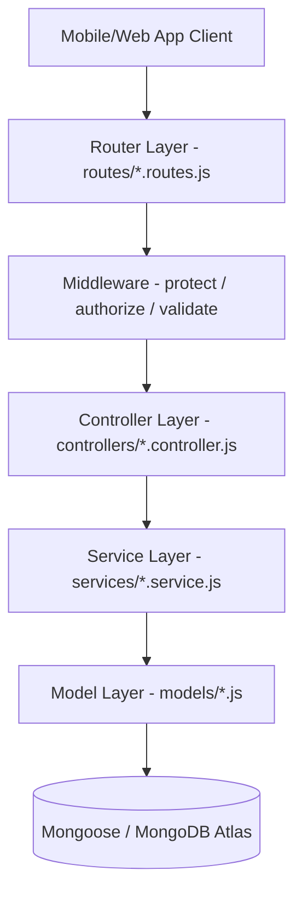

# 04 ARCHITECTURE REVIEW
**Date:** 2026-07-06  
**Auditor:** Principal Software Architect

This document reviews the overall structural integrity, framework conventions, separation of concerns, and architectural design choices of the College Management System.

---

## 1. BACKEND ARCHITECTURE (MVC + Services)
The backend codebase uses a structured Model-View-Controller pattern decoupled with a Service Layer:

### Separation of Concerns Audit
- **Router Layer:** Maps endpoints to controllers. Enforces authentication (`protect`) and role verification (`authorize`) prior to handler invocation.
- **Middleware Layer:** Handles token checks, role gates, request validation (`express-validator`), and error handling (`errorHandler.js`).
- **Controller Layer:** Coordinates responses, handles input formatting, and sends JSON payloads wrapping response shapes (`ApiResponse`).
- **Service Layer:** Houses all business rules, database queries, and third-party integrations (such as bulk XLSX compilers).
- **Model Layer:** Houses the Mongoose schemas, indexes, and document methods (e.g. `comparePassword`).

---

## 2. FRONTEND ARCHITECTURE (Expo Router & Hooks)
The React Native Expo frontend uses directory-based routing (`app/` folder) and context-based state management:

- **Directory-Based Routing:**
  - `app/admin/`: Screens for departments, logs, profile registration, student/faculty management.
  - `app/faculty/`: Screens for students lists, marks posting, attendance logs, updates.
  - `app/student/`: Screens for dashboard stats, achievements, academic profile.
- **Global Contexts:**
  - `AuthContext.jsx`: Persists logged-in user tokens, handles login, logout, and token refresh.
  - `MessageContext.jsx`: Handles direct messaging, inbox polling, and conversation state sync.
- **Hook Layer:** Decoupled service hooks (e.g. `useMessages`, `useSearch`) separate state handling from UI view templates.
